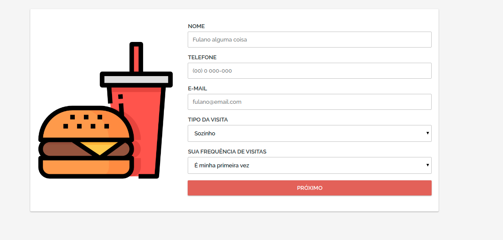
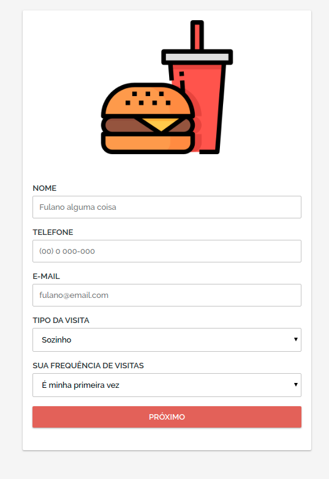

# Pesquisa de satisfação

### Desktop view

### Mobile view

Objetivo: coletar de maneira simples e rápida a opnião dos clientes de um estabelecimento (foi usado como exemplo uma local que trabalha com lanches, tipo hamburguer ou pizza).

# Tecnologias

Foi construido em NodeJS e integrado a uma planilha do Google Docs, que é o recurso utilizado para armazenar as informações, atravéz de uma API do google Drive (mas nada impede a construção de um dashboard e integração a um banco de dados, massssssss isso é um MVP (produto mínimo viável)).

# Dependencies

- express
- ejs
- google-spreadsheet (client da API)

# Se for clonar

- Crie uma planilha no Google Docs
- Pegue o ID dela
- Colocar na const "spreadSheet_ID" no index entry point
- Gerar configurações de autenticação na API (lá pelo Google Console)
- Compartilhar a planilha com o email gerado na autenticação